# AeyeBot – Assistive Indoor Navigation Robot for Visually Impaired Users

An advanced robotic assistant that helps visually impaired people navigate indoor spaces autonomously and safely. AeyeBot uses a dual‑controller architecture (Arduino Mega 2560 for real‑time obstacle avoidance, Raspberry Pi 5 for AI‑based object detection and voice interaction). It achieves 95% object detection accuracy, 96.7% obstacle detection accuracy, and 6‑8 hours of battery life.

## Introduction

Globally, an estimated 1.1 billion people live with some form of vision loss, projected to reach 1.7 billion by 2050. Traditional aids (white canes, guide dogs) have limitations in providing real‑time information or interactive guidance. AeyeBot fills this gap by combining autonomous navigation, object detection, and voice‑based assistance in a single mobile platform.

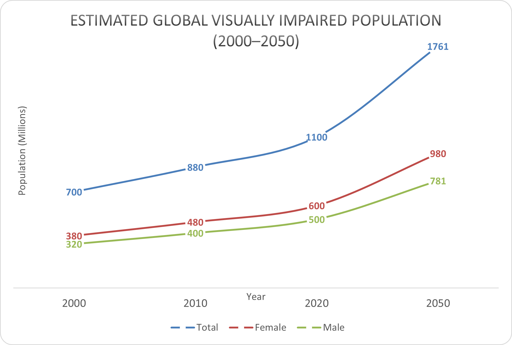

*Figure 1 – Estimated global visually impaired population by gender (2000‑2050). The graph shows a steady increase over time, with females consistently more affected than males across all years.*

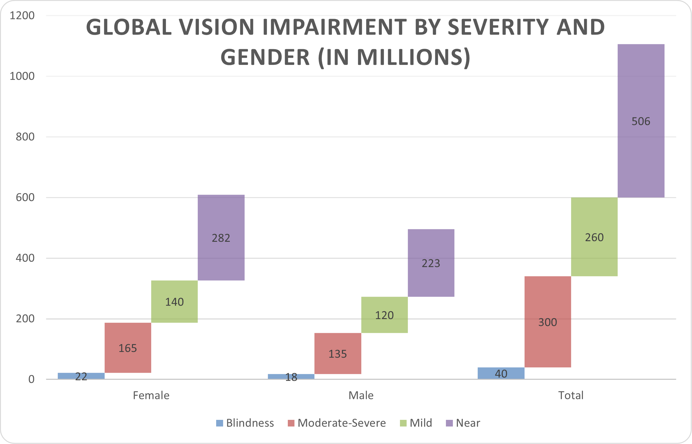

*Figure 2 – Global vision impairment broken down by severity (mild, moderate, severe, blind) and gender. Females have higher rates in every category, highlighting the need for accessible assistive technologies.*

## Related Works – Vertical Spectrum

The review of 24 existing assistive systems reveals a wide range of approaches, from simple wearable devices to complex robotic guides. Figure 3 organises these systems along a vertical spectrum.

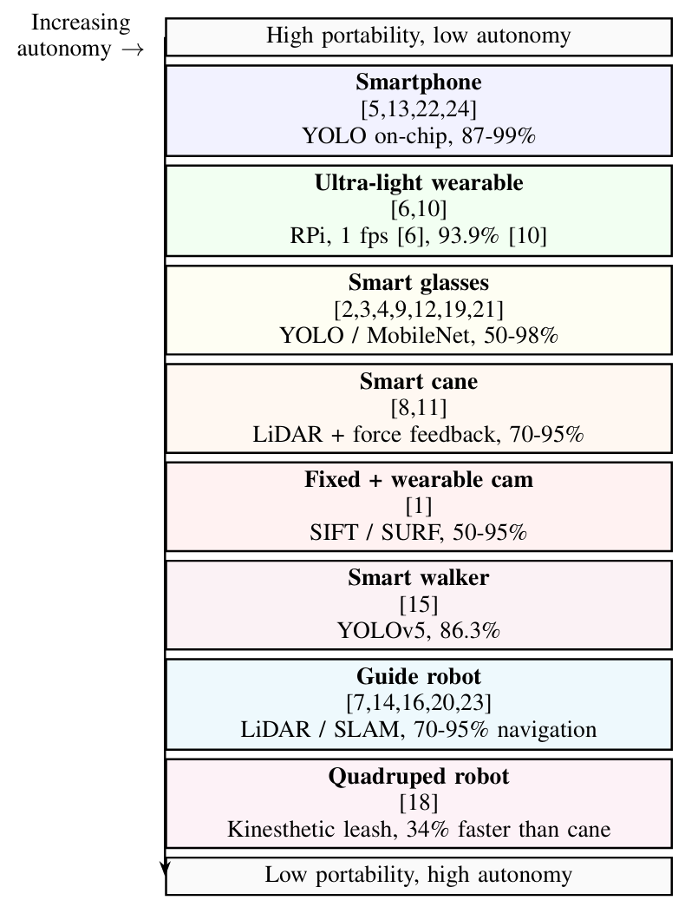

*Figure 3 – Vertical spectrum of assistive systems (paper numbers in brackets). At the top are lightweight, easy‑to‑use solutions such as smartphone applications (e.g., Vision Assist [24], NAVISIGHT [22]). In the middle are wearable devices like smart glasses and smart canes (e.g., NanoEye [12], AI smart cane [11]). At the bottom are sophisticated mobile robotic systems (e.g., CaBot [23], RDog [18], WanderGuide [20]) that offer autonomous navigation but are heavier and more complex. AeyeBot sits at the lower end of the spectrum, combining autonomous mobility with voice interaction and real‑time object detection.*

## System Architecture – High‑Level Design

AeyeBot is built around a layered architecture that separates hardware, communication, and decision‑making. Figure 8 shows the functional modules and data flow.

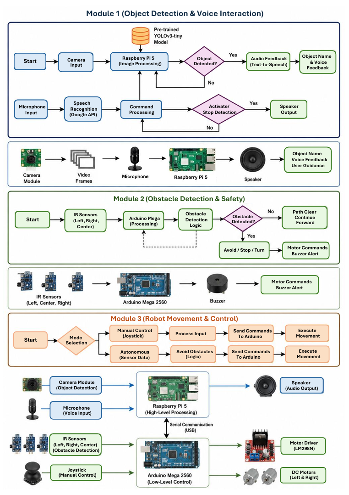

*Figure 4 – High‑level system architecture. The input layer captures camera images, IR sensor data, and microphone audio. The perception layer (Raspberry Pi) runs YOLOv3‑tiny for object detection and Google Speech API for voice commands. The information classification layer organises system states and obstacles. The decision layer (Arduino) controls motor actions and obstacle avoidance. The output layer provides audio feedback, buzzer alerts, and wheel movement.*

## Dual‑Controller Flowcharts

The system runs two parallel processes: one on the Raspberry Pi (vision + voice) and one on the Arduino (obstacle avoidance + motor control).

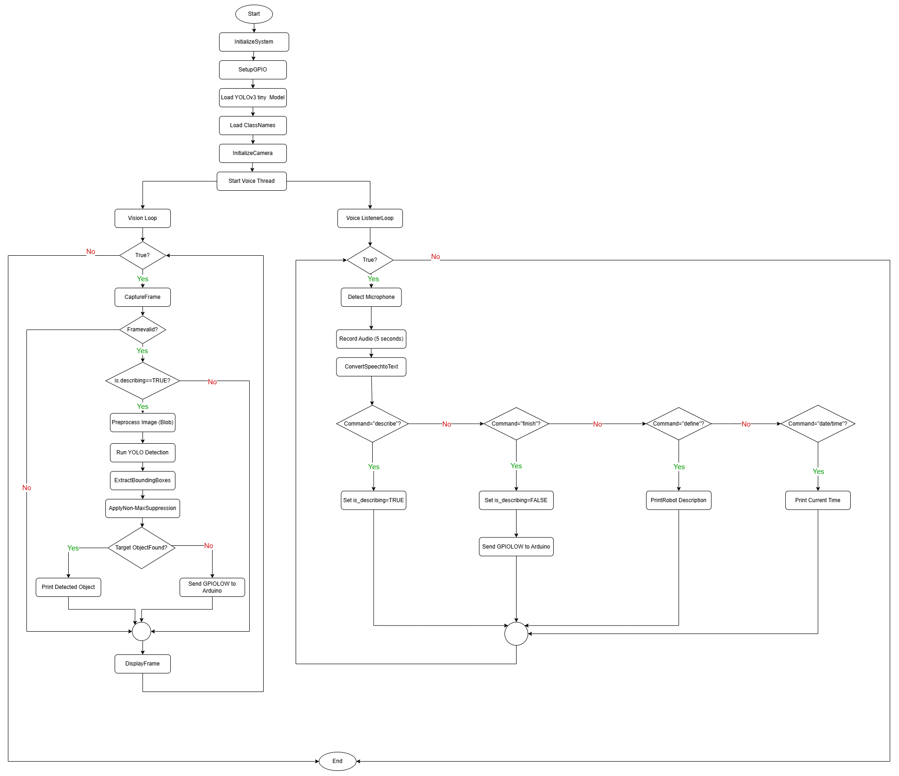

*Figure 5(a) – Raspberry Pi high‑level tasks. The vision thread captures frames, runs YOLOv3‑tiny, and sets GPIO pin 40 HIGH when a target object is detected. The voice thread listens for commands (“describe”, “finish”, “define”, “date/time”) using the Google Speech API and responds via speaker.*

*Figure 5(b) – Arduino real‑time safety loop. The Arduino continuously reads three IR sensors, applies the finite‑state machine for obstacle avoidance, and controls the motors and buzzer. It also checks GPIO pin 40 from the Pi – if HIGH, it stops movement immediately to avoid collision with a detected object.*

## YOLOv3‑tiny Architecture

The object detection model is YOLOv3‑tiny – a lightweight version of YOLOv3 designed for embedded platforms. Figure 10 illustrates the network structure.

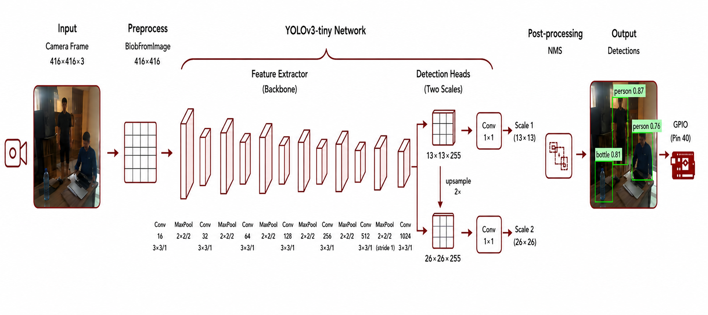

*Figure 6 – YOLOv3‑tiny architecture. The network takes a 416×416×3 input image, passes through 13 convolutional layers and 6 max‑pooling layers. It then splits into two detection heads: a 13×13 grid for large objects and an upsampled 26×26 grid for small objects. This dual‑head design enables multi‑scale detection in a single forward pass. The model size is 33 MB, and inference time on Raspberry Pi 5 is 120‑200 ms at 0.3 confidence threshold.*

## Circuit Diagram – Low‑Level Connections

Figure 7 shows the complete circuit connections between the Raspberry Pi 5, Arduino Mega 2560, sensors, motors, and power supplies.

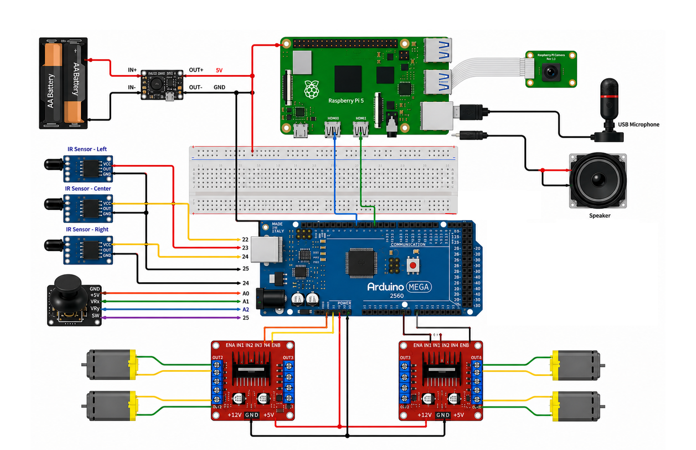

*Figure 8 – Full circuit diagram. A 12 V battery feeds an LM2596 buck converter that outputs 5 V to power the Raspberry Pi, Arduino Mega, and IR sensors. The L298N motor drivers are powered directly from the 12 V supply. Three IR digital sensors connect to Arduino digital pins. The Arduino communicates with the Pi via USB serial and a GPIO interrupt line (GPIO17). A USB microphone and Bluetooth speaker connect to the Pi. Four DC gear motors in differential drive configuration are controlled by PWM signals from the Arduino.*

## Final Robot Design – Exterior and Chassis

The physical AeyeBot prototype is built on a custom metal frame with 19 3D‑printed PLA parts. Figure 4 shows the final exterior design.

*Figure 9 – The finished AeyeBot robot. The upper “head” houses the Raspberry Pi, camera, and microphone. The lower body contains the Arduino Mega 2560, motor drivers, batteries, and three IR sensors (visible as yellow cylinders at the base). The adjustable handle allows users to push the robot comfortably. The 20 kg weight ensures stability during turns and obstacle avoidance.*

## Experimental Setup and Evaluation

All tests were performed indoors under standard fluorescent lighting (>200 lux) on a flat, clutter‑free floor.

- **Object detection**: Six target classes (person, bottle, laptop, chair, keyboard, monitor) placed at 0.5‑2.0 m distances, varying orientations. 30 trials per class.
- **Obstacle detection**: Obstacles placed at 10‑80 cm covering left, centre, and right sensor zones. Eight possible IR sensor state combinations tested.
- **Voice recognition**: Commands spoken at normal volume, ambient noise <40 dB, 30 trials per command.

## Results and Discussion

### Object Detection (YOLOv3‑tiny on Raspberry Pi 5)

The model achieves **95% accuracy** with response time **≤1 second**, exceeding the 90% target. Figure 17 shows sample detection outputs for four object categories.

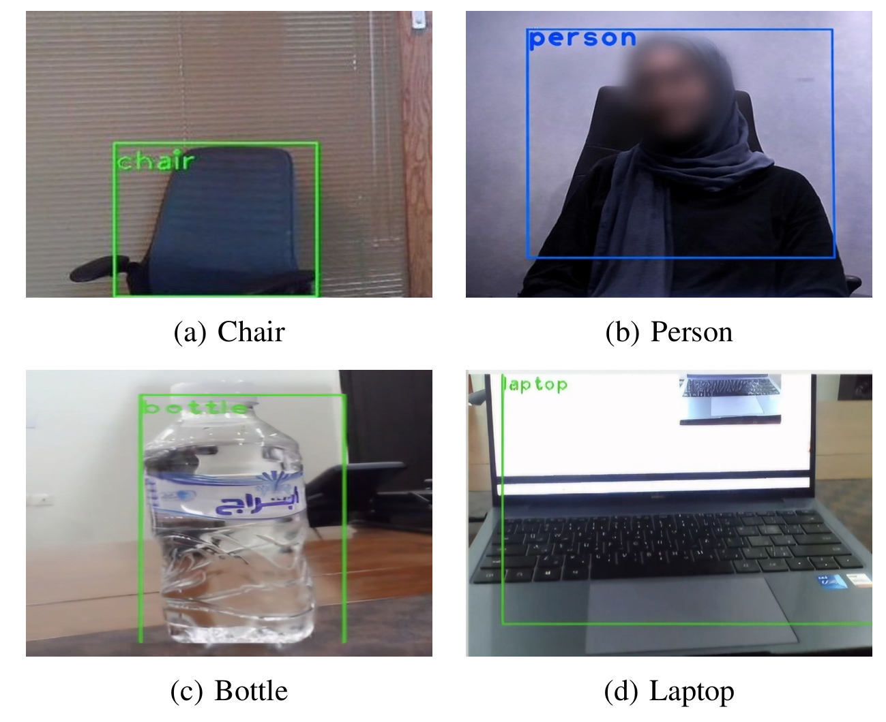

*Figure 10 – Example detections from YOLOv3‑tiny running on the Raspberry Pi 5. Bounding boxes with confidence scores (>0.3) are overlaid on the live camera feed.*

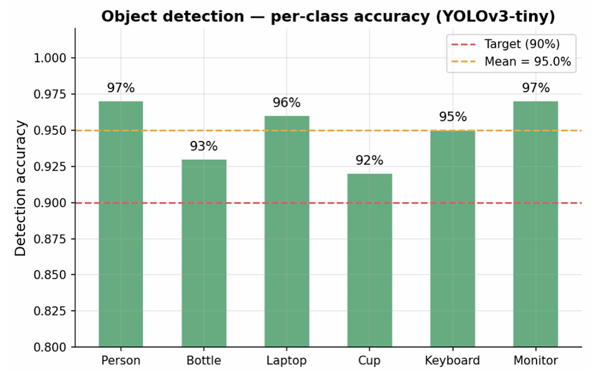

*Figure 11 – Detection accuracy broken down by object class. The highest accuracy is for “person” and “chair” (near 100%), while “keyboard” and “monitor” are slightly lower due to smaller size and less distinctive features.*

### Voice Recognition (Google Speech API)

Average response time is **4.83 seconds** (range 4.0‑6.0 s) with **90% accuracy**. The bootstrap confidence interval is [73.3%, 96.7%].

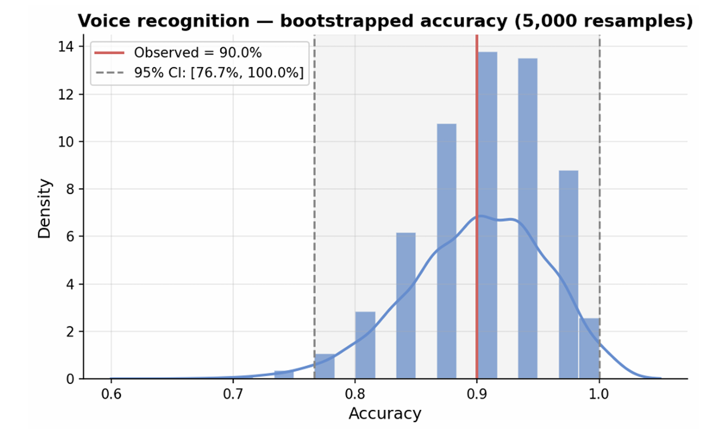

*Figure 12 – Bootstrapped accuracy distribution (5,000 resamples) for voice recognition. The observed accuracy is 90%, with a 95% confidence interval ranging from 73.3% to 96.7%.*

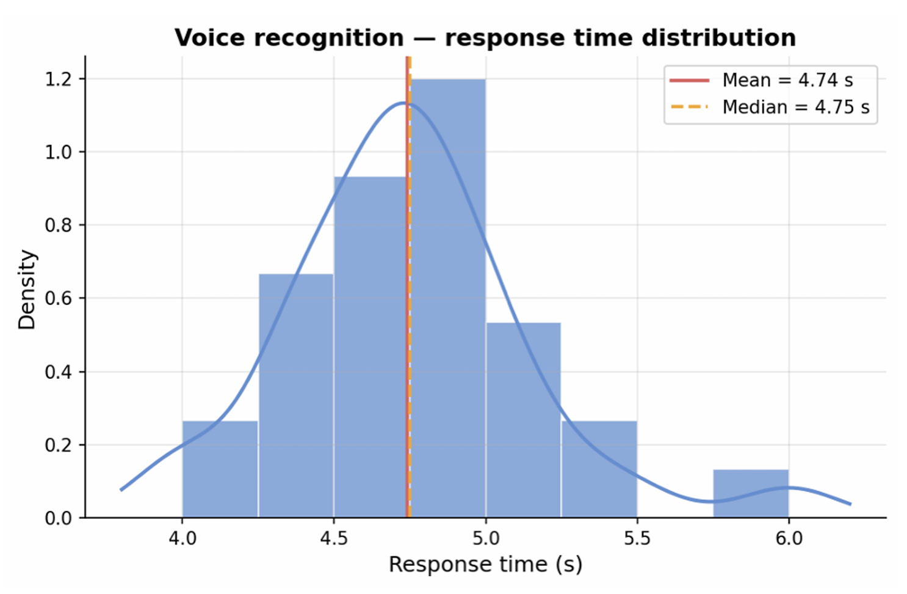

*Figure 13 – Response time distribution across 30 trials (mean 4.83 s, median 4.80 s). The fixed 5‑second audio recording window is the main contributor to latency; cloud API processing adds a small additional delay.*

### Obstacle Detection and Avoidance (Arduino Mega 2560)

The system achieves **96.7% accuracy** with mean response time **0.402 seconds**. The Arduino polls three IR sensors every 20 ms and executes motor commands based on a finite‑state machine.

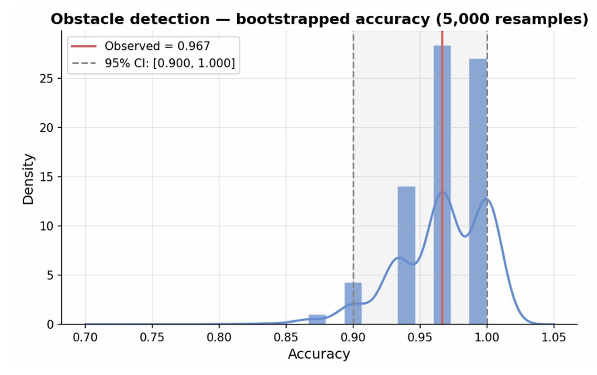

*Figure 14 – Bootstrapped accuracy distribution (5,000 resamples) for obstacle detection. Observed accuracy is 96.7%, with a 95% confidence interval of [80.0%, 100.0%].*

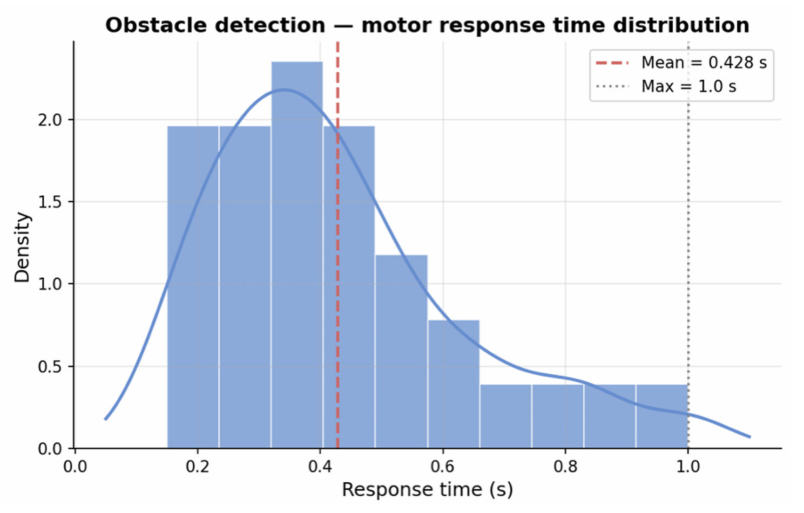

*Figure 15 – Motor response time distribution (mean 0.402 s, max 1.0 s). The distribution is right‑skewed, indicating consistently fast responses with rare delays under worst‑case sensor transitions.*

## Performance Summary

| Subsystem          | Metric         | Achieved Value |
|--------------------|----------------|----------------|
| Object Detection   | Accuracy       | 95%            |
|                    | Response Time  | ≤1 s           |
| Obstacle Detection | Accuracy       | 96.7%          |
|                    | Response Time  | 0.40 s (avg)   |
| Voice Recognition  | Accuracy       | 90%            |
|                    | Response Time  | 4.83 s (avg)   |

## Limitations

| Limitation                     | Explanation                                                      |
|--------------------------------|------------------------------------------------------------------|
| Limited IR sensor range        | Operates only 10–80 cm; beyond not detected.                     |
| No outdoor navigation          | Indoor only; cannot handle stairs, ramps, or uneven terrain.     |
| Voice response latency         | Average 4.83 s due to fixed 5 s recording + cloud API.           |
| Restricted object classes      | Only 6 of the 80 COCO classes are used.                          |
| Lighting sensitivity           | Performance degrades below 200 lux; no night vision.             |
| Weight and portability         | 20 kg – heavy, push‑cart style only.                             |
| No SLAM / spatial mapping      | Reacts only to immediate IR readings, no map‑based planning.     |
| No formal user study           | Only technical metrics; no testing with blind/VI users.          |
| No GPS                         | Unsuitable for outdoor navigation.                               |

## Conclusion

AeyeBot successfully demonstrates a dual‑controller assistive robot for visually impaired users. It meets all performance targets: 95% object detection accuracy (<1 s), 96.7% obstacle detection accuracy (0.4 s response), and 6‑8 hours of battery life. The separation of real‑time safety tasks (Arduino) from AI and voice processing (Raspberry Pi) proves effective. Future work includes on‑device speech recognition to reduce latency, adding ultrasonic sensors for longer range, implementing SLAM for map‑based navigation, reducing weight, and conducting formal user studies with blind participants.

## References

[1] Yi, C. et al. (2013). Finding objects for assisting blind people.  
[2] Lin, Y. et al. (2019). Deep learning based wearable assistive system.  
[3] Bai, J. et al. (2019). Wearable travel aid for visually impaired.  
[4] Joshi, R. C. et al. (2020). Efficient multi‑object detection smart navigation.  
[5] Ghosh, A. et al. (2020). Assistive technology for visually impaired using TensorFlow.  
[6] Khan, M. A. et al. (2020). AI‑based visual aid for the completely blind.  
[7] Lai, J. et al. (2021). Design of a portable indoor guide robot.  
[8] Slade, P. et al. (2021). Multimodal sensing for people with impaired vision.  
[9] Ashiq, F. et al. (2022). CNN‑based object recognition for visually impaired.  
[10] Mulyono, K. M. et al. (2022). Real‑time object detection for blind using CNN.  
[11] Gad, A. et al. (2023). Safer navigation: AI‑powered smart cane.  
[12] Hamid, I. et al. (2023). Realtime object detection for blind (NanoEye).  
[13] Sabin, T. T. et al. (2023). AI based pilot system for visually impaired.  
[14] Duan, L. et al. (2023). Considerate guide mobile robot for visually impaired.  
[15] Shilaskar, S. et al. (2024). Enhanced mobility: smart walker.  
[16] Oluyele, S. et al. (2024). Robotic assistant for object recognition.  
[17] Nagil, P. & Mandal, S. K. (2024). DISHA: low‑energy sparse transformer.  
[18] Cai, S. et al. (2024). Quadruped robot guiding system (RDog).  
[19] Baig, M. S. A. et al. (2024). AI‑based wearable vision assistance.  
[20] Kuribayashi, M. et al. (2025). WanderGuide: indoor map‑less robotic guide.  
[21] Narendra, L. et al. (2025). Smart glasses with voice assistance and GPS.  
[22] Sachin, A. et al. (2025). NAVISIGHT: deep learning for indoor navigation.  
[23] Guerreiro, J. et al. (2019). CaBot: autonomous navigation robot for blind people.  
[24] Karthiyayini, J. et al. (2025). Vision Assist – Object detection for the blind.  
[25] World Health Organization. (2023). Blindness and vision impairment.  
[29] IAPB (2025). Global data – Vision Atlas.  
[30] Alenezi, L. et al. (2026). AeyeBot_Assistive_Robot. GitHub.
